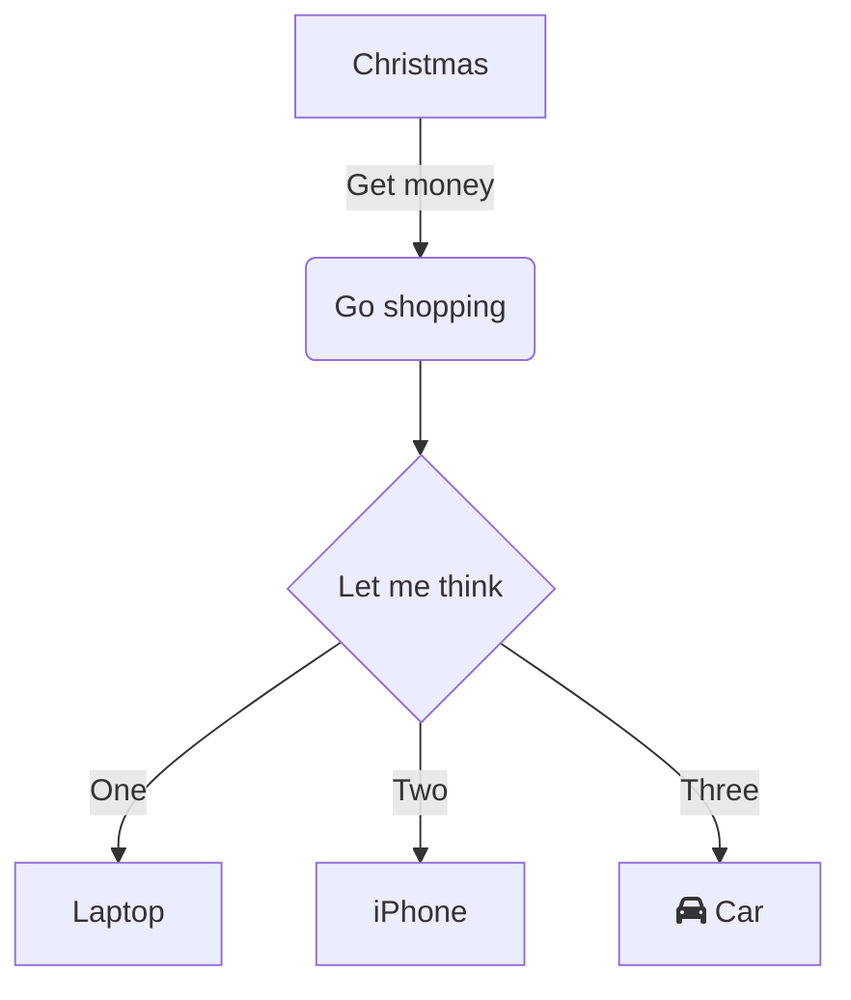
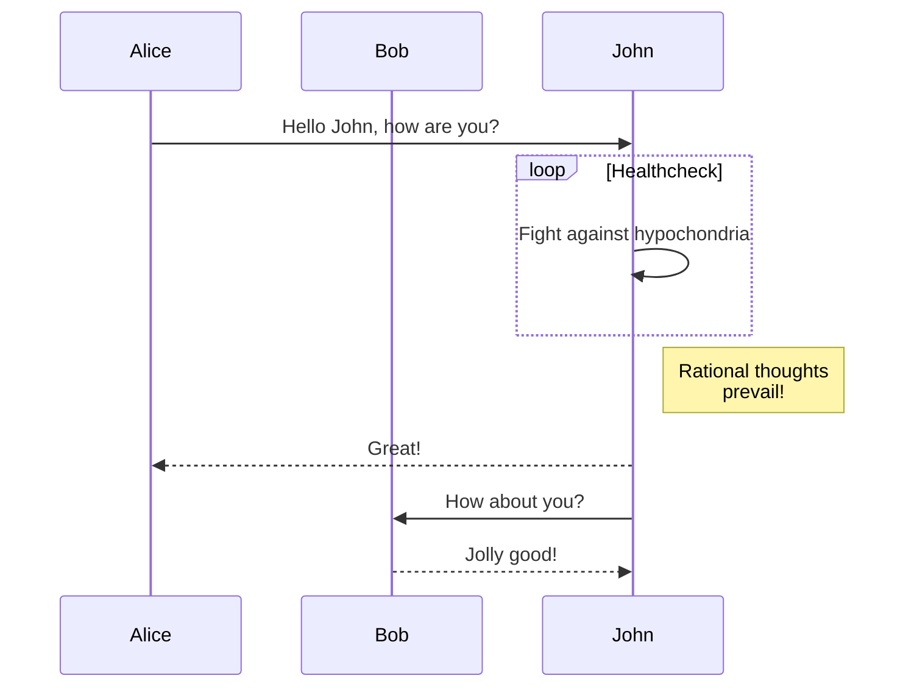

+++
date = '2025-08-01T12:28:39+08:00'
draft = false
title = 'My Second Post'
+++

# This is the second post.

<meta hello="d" content="asfd dsf dsa fsad fas dfsa dfa sdf adsf sad fasd sa df asdf asdf asd fasd fsa dfa sdf asfd asd fas dfa sdf asfd asd fa df asdf as fda sfd sadf sad fsa df sadf asd fsad fsa df sadf sad fsa df saf sad fdsa f saf asfd sa dfa sdf sad fsa fd sadf sa f sad fas df sad fas df 
dsaf asd fas df safd asd fsa df 
ads f safd as dfasd fad sf sdf 
sadf as dfsa fd ">

<!-- comment 

so just add whatever comment here is ok. That would be great.

-->
